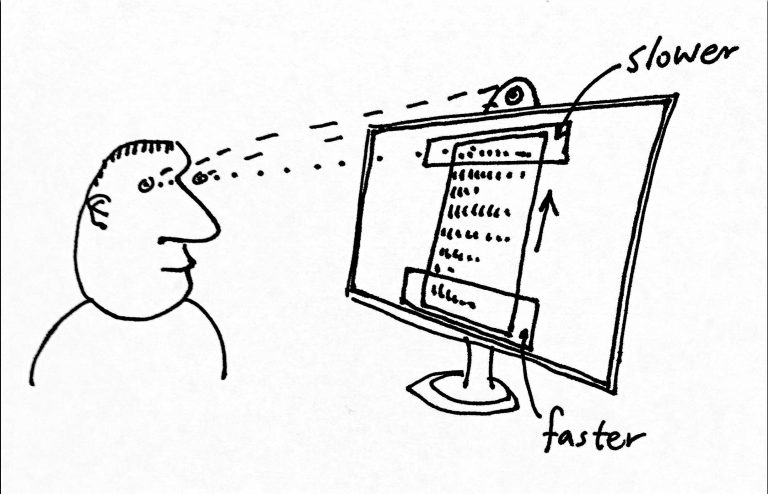

In this three-week module in _Interactivity_, students explored the notions of implicit interaction with computer vision techniques.

In _Interactivity_ students purposefully do not create concepts or solve problems, they are engaged with pure experimentation and building knowledge through design.

# Scrolling
## Erik Cronqvist & Johan Hultman

This sketch purposefully subverts the usual reading interaction. By looking at the center of the screen, the text scrolls automatically. Looking lower makes it scroll faster, looking higher slows the scrolling.

<Video src="2017/images/implicit-ec-2.webm" />
  

# Focus
## Lisa Bolmsten & Nathalie Strindlund

These sketches explored gaze and an interface’s visual representation.

<Video src="2017/images/implicit-focus-2.webm" />

A notification has a lower visual prominence when the head is turned toward it.

<Video src="2017/images/implicit-focus-0.webm" />

A document blurs out when your head is turned away.

# Activity
## Sebastian Thorén & Rebecka Wärulf

Sketches exploring leaving traces of movement.

<section className="imageSet">

<Video src="2017/images/implicit-act-1.webm" />
<Video src="2017/images/implicit-act-2.webm" />
<Video src="2017/images/implicit-act-3a.webm" />

</section>

