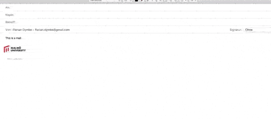
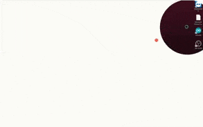
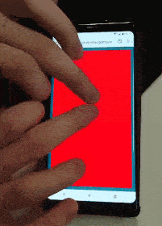

Underpinning modern user interfaces is spatiality. An icon might 'live' on a surface, or inside a container. Windows might be arranged and sized in a space defined by the physical screen or virtual space. User interface elements have a "vertical" ordering, allowing some things to be visible at the surface, while others get buried behind.

In this three-week module, students tried to set aside taken-for-granted notions of spatiality, and experiment with their own. Not just a model of space, but also how to interactively establish space, or work within a kind of space. For this module, students had to work with multi-touch interaction.

In the course <em>Interactivity</em>, students purposefully do not create concepts or solve problems, they are engaged with pure experimentation and building knowledge through design. A large quantity of sketches are produced, here we draw out a handful.

# Nested
## Kristina Arnold & Kaylin Lee

This abstract sketch establishes a limited, structured space around the focal object (in this case, a body of text). Pinching and holding allows objects to be moved within the space, or placed outside.

<Video path="2018/images/ix-space-1-1.webm" />

# Portals
## Alexander Grövnes & Florian Dymke

These two sketches show some of the exploration in a portal-like notion of space that can be temporarily delved into whilst 'remaining' in another space. 

<ImageSet>

</ImageSet>

# Depth 1
## Kim Jankowski

This sketch works with a notion of spaced that is layered with depth. As the region is pulled apart, deeper regions are revealed. In principle, the layers being revealed can also be interacted with as the seam is held open.

# Depth 2
## Ellen Mårtensson & Pedro Marinho

This sketch came out of a similar inquiry into working with layered space. In this interaction, pressing the surface reveals stacked panels, and with a continuous movement the user can select what space to enter. 

<Video path="2018/images/ix-space-4-1.webm" />

