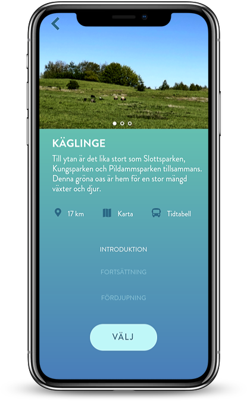
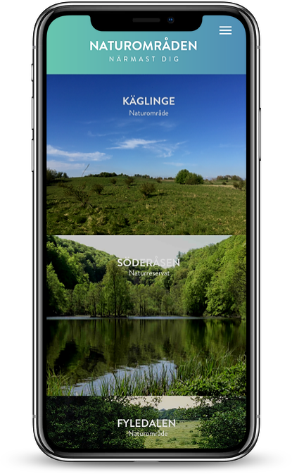
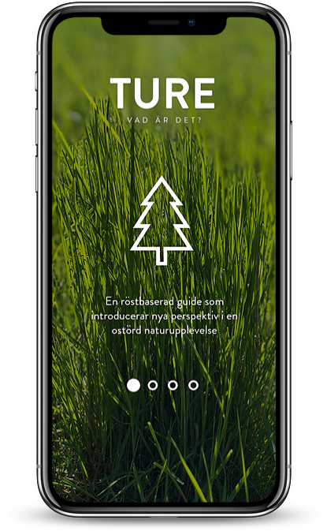

Spending time in nature will improve your physical and psychological health,
but doing this is currently an exception rather than the norm. Technology has
enabled simulated immersive nature experiences that can be experienced on
the users conditions, but these lack the physical and multisensory qualities
that authentic nature have.

The aim of this thesis was to explore how technology could be used to enable
and strengthen authentic nature experiences, without stealing attention. The
findings from a user-centred design process served as the foundation for a
forest bathing inspired service. The design proposal used a holistic approach
that intended to make nature experiences more accessible, but also more
mindful and undemanding. The user tests showed promising results, but
future work could benefit from taking a more narrow approach, to generate
more specific knowledge to the growing field of interaction design in a nature
context.

<ImageSet>

</ImageSet>

The digital forest bathing guide aims to promote well-being by introducing a relaxed and undemanding "non-activity" in a restorative nature setting. The narrated instructions in the guide were heavily inspired by forest bathing, but in a more accessible and local manner. The purpose of the guide is to introduce new ways of experiencing nature for young urban dwellers, and it’s only positive if the user learns the techniques and experiences nature without any guidance. The guide was in the form of an smartphone app that enables users to discover and get to new nature areas, listen to the guide and also disconnect the obtrusive side of technology. The downloaded, local form of an app, relates to the idea of a personal guide that you can trust on.

<ImageSet>

</ImageSet>

After prototyping a custom wearable for delivering the audio guide part of the experience (left), off-the-shelf Bose Soundwear speakers were chosen (right).

