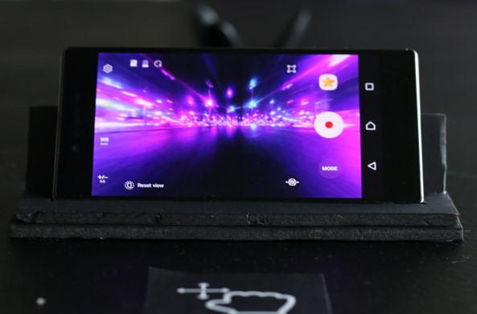
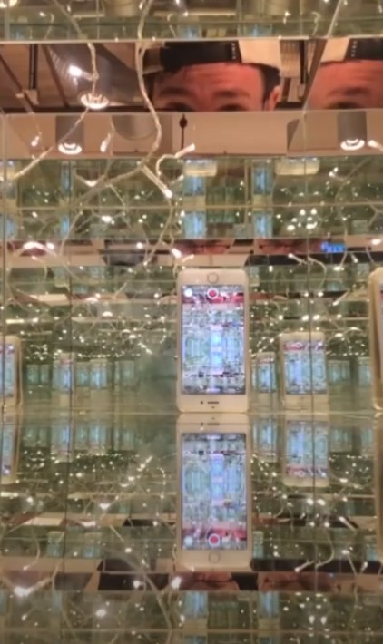
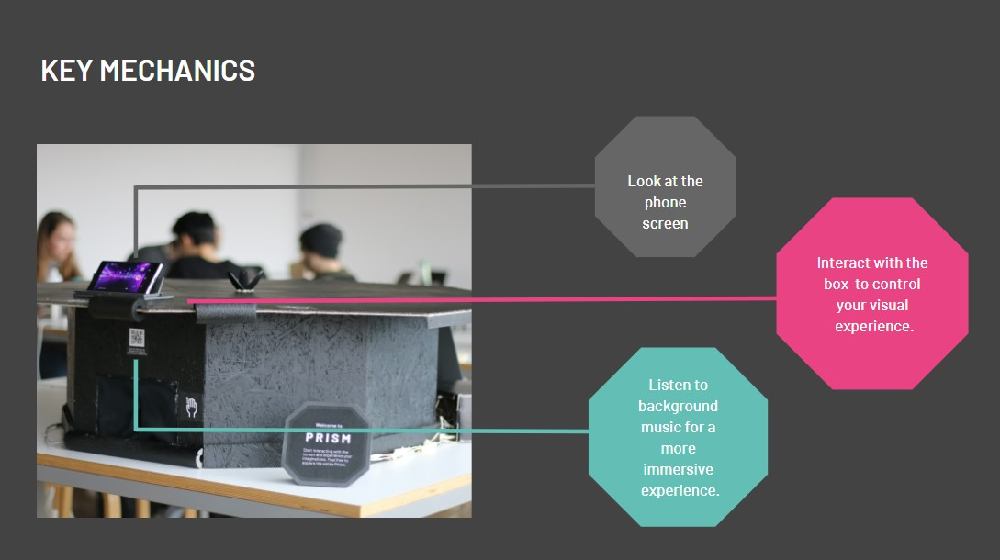

An interactive toy that simulates visual experience of an enclosed space using light and mirrors.

<MauVideo id="0_hk2imwek" />

Players glimpse a hidden psychedelic world through the periscope of a small screen. They are able to manipulate the world by way of movement sensors in the handles of the whole object.

<ImageSet>

</ImageSet>

