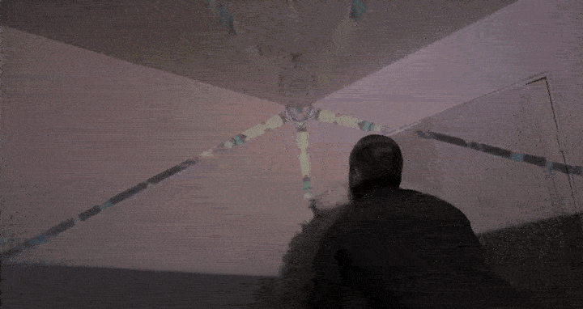
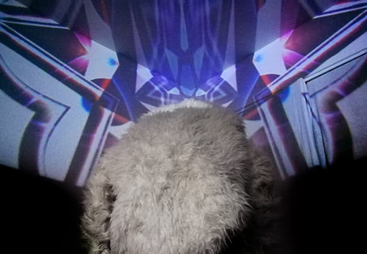
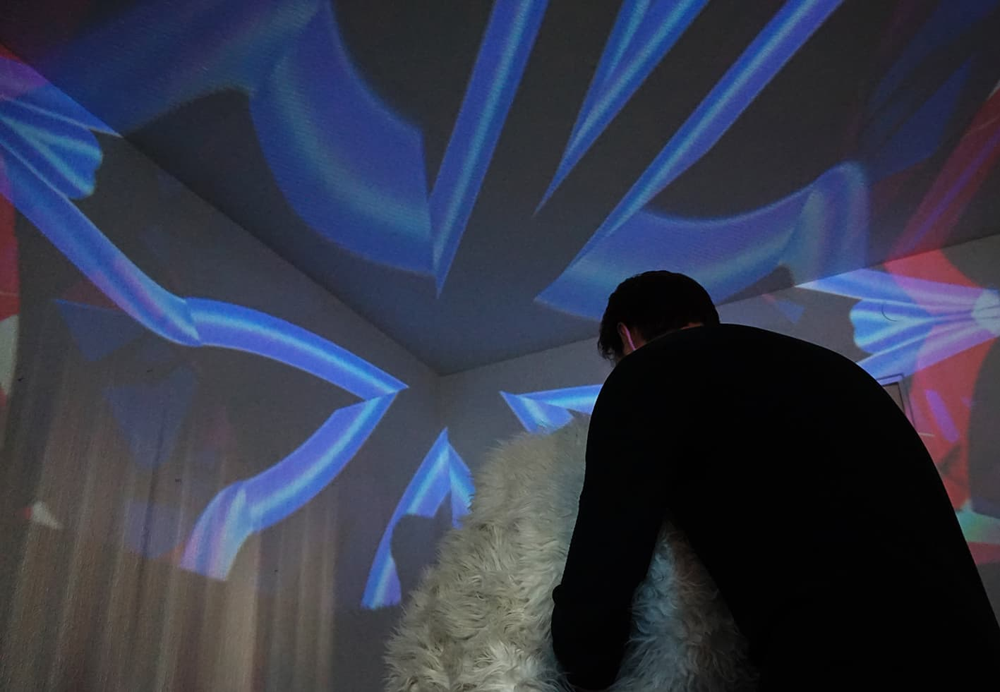

The interest in designing interactive systems is going beyond their functionality and more towards their aesthetics. Often, research fails to address how qualities of the interaction as a medium can actually create pleasurable experiences. However, it points out the importance of understanding temporal aspects of interactions to understand their aesthetics. The aim for this thesis is to address this by the creation and evaluation of an interactive artwork working as a platform to explore relations between 'interaction attributes' (Lenz et al. 2013) and 'Pleasures' (Costello, 2009), as well as how temporal aspects in interactions can affect these Pleasures. This to help interaction designers think more clearly around and make better design choices regarding interactions within interactive systems. The results of this showed that there can be many such relations, but also that they are complex. Additionally, it is discussed that Pleasures might also partly be experienced before or after the interaction with the artwork.

<ImageSet>

</ImageSet>

To interact with the artwork, a large fluffy housing was designed. Participants insert their arms into holes in the side, holding inside a large diameter steel ball. 

<ImageSet>

</ImageSet>

## References

* Lenz, E., Diefenbach, S., & Hassenzahl, M. (2013, September). Exploring relationships between interaction attributes and experience. In Proceedings of the 6th International Conference on Designing Pleasurable Products and Interfaces (p. 126-135). ACM. 
* Costello, B. (2009). Play and the experience of interactive art (PhD thesis). University of Technology, Sydney