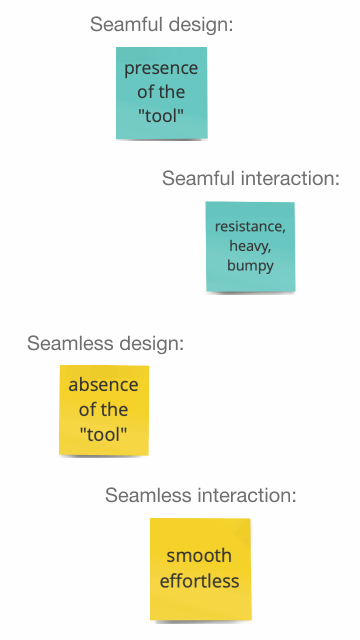
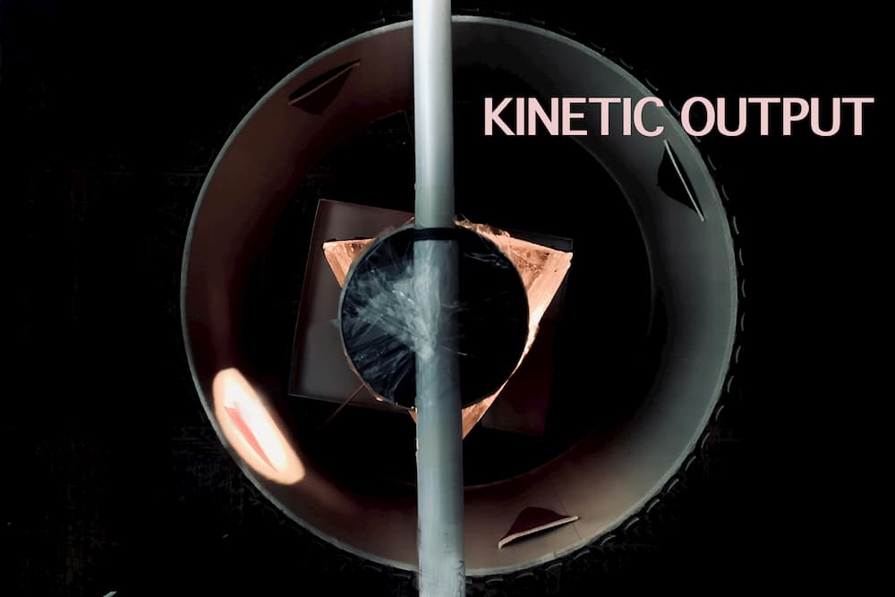
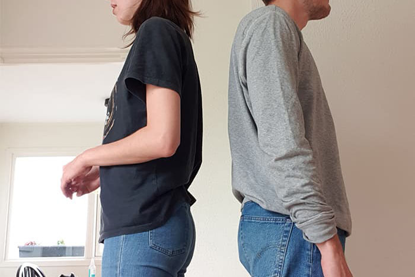
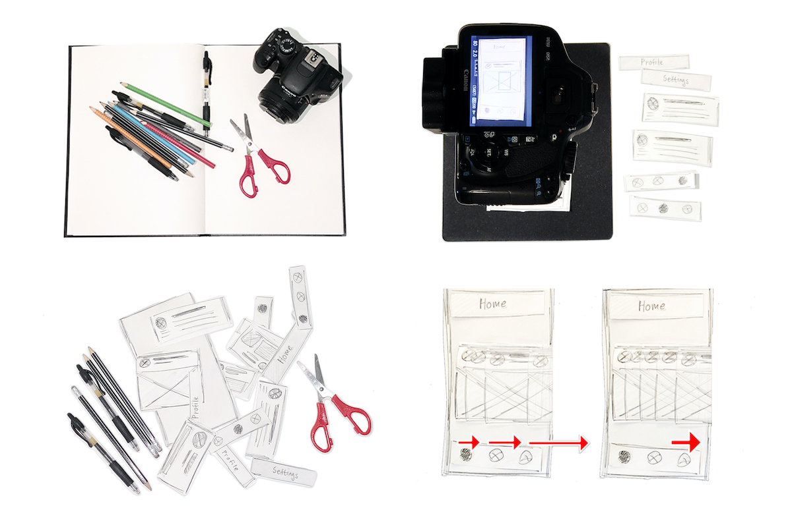
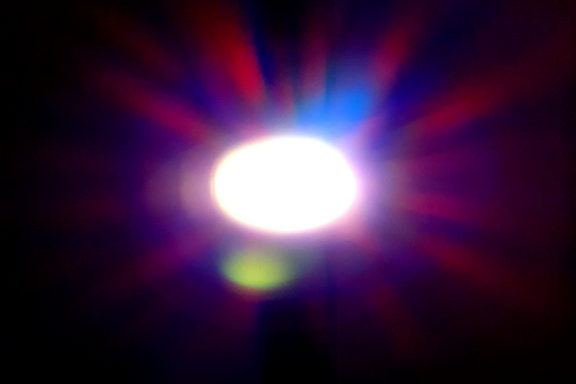
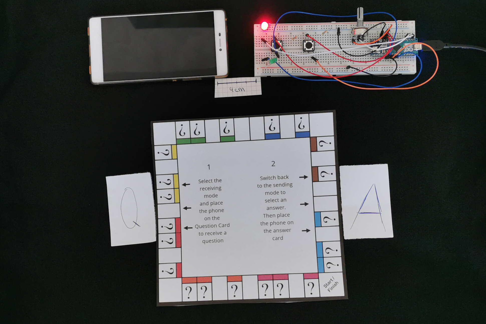

Our first year students in Interaction Design present the outcomes of a short individual design project on a self-chosen topic within one of three categories:

 - exploring what an interaction **designer’s material** could be
 - (re)designing a **design method**
 - bringing **aesthetic notions** to life in design elements

---

# Investigating the aesthetics of seamlessness and seamfulness
## Clara Isaksson

The word "seamless" is often heard describing an experience of an interactive artifact. This might mean that the interaction was smooth, effortless and didn't demand the user to really stop and think. Academics have criticized this strive for seamless artifacts and have thus given examples of "seamful" artifacts instead. The issue with this supposed opposite is that "seamfulness" is poorly defined, leading to confusing conclusions of what seamfulness is or isn't. Through my research I realized that seamful design can lead to a seamless interactions - and seamless design can lead to seamful interactions. Since this sounds like a contradiction I decided to devote this "Studio" course to further explore and experiment with these aesthetics.

[Try the mock-up](https://xd.adobe.com/view/4c394878-71b3-466f-7489-aae35e3e6e36-3a08/)

# Kinetic output
## Dina Pitkänen

This project takes a closer look into how movements can be seen as material within interaction design forming tangible outputs. It contains inspirational bits which are created to expose three themes: 'Space and depth', 'Complex vs non-complex movements' and 'The language of movements'. The aim is to invite stakeholders to see space as a resource to be exploited in future design work, to get more familiar with what it means to predict and control movements and in general get more used to approach the material 'movements' as a container of a broad spectrum with design opportunities which is yet to be further discovered.

# Notion of empathy in Cultural Probes
## Vera Boateng

Design without empathy is quite inconceivable, just like trying to catch fish in a deep-sea with a spoon. In traditional design methods, designers immerse themselves in the user tests. But what happens when the user has more liberty to be creative and reflective during the user test, whilst being miles away from the intrusive grasp of the designer? Does this affect the empathic knowledge gained by the designer?

# Interaction Aesthetics in Verbal Communication
## Felicia Del Treppo

The present research regarding aesthetics of interaction have primarily focused on interactions based on bodily movement. After conducting a literature review of aesthetics of interacting with smart home devices through voice control it was obvious that there is a need for conducting experiments with aesthetics in verbal communication. In this study I did various experiments tweaking and manipulating the way in which we communicate verbally as well as the act of listening. For example, "How would it feel to talk to my smart assistant in a therapeutic way?".

# Unpacking Machine Learning as a design material with gestures as a modality
## Johan Franzén

Understanding how we can use ML as a design material to create interactive experiences can be tricky, so I explored different interactive modalities with ML before narrowing it down to gestures. Through three samples of ML with gestures, we unpack and get a look into understanding ML as a material in compound with a modality. Further, the samples show and communicate what otherwise can be hard to grasp in only descriptive terms. I hope these samples inspire and further encourages exploration of ML in playful ways.

# Stop-Motion for Sketching Transitions in User Interface Design
## Ivar Lundin

In order to sketch transitions in user interface design, this project proposes using stop motion as a method. Through practical experiences and the use of participants the method has been evaluated and the benefits and limitations are brought up. Furthermore a general guide of using the method has been develop in order to aid beginners.

# Potential of Light as a material
## My Mikkelsen Sjöholm

I'm exploring light as a material. How to control the light in a 3D space and steering the eye's attention in different ways. With the help of simple 3D spaces and prototypes built out of cardboard boxes I'm playing with how light is shown and how it affects the surroundings. With the lights properties of being able to change and re-shape quickly it’s a great recourse that I believe is underestimated. 

# Exploring the Sonification of a GUI
## Isak Eklund

Working with sound in interaction design to create an elevated experience with a classic GUI. Experiments have been done with sound to classic GUI elements and then evaluated to see what sort of emotions that will create with the used. Questions like: Can we create a calmer experience? Or can we increase the intensity of an interaction with sounds? In the end all the different parts where added up to an ambient, full scale GUI with sounds. Resulting in a forest background with birds singing and all the other sounds are collected from the forest etc.

<MauVideo id="0_vgoye0eu" />

# Exploring NFC
## Hannes Siebeneicher

NFC has over the last decade found its way into most smartphones and is often used for contactless payment or pairing of Bluetooth devices. These use cases however only illustrate one out of three modes that NFC can operate in. To better understand the properties and limitations of NFC and especially the peer-to-peer mode inspirational bits are presented. Through two different inspirational bits limitations like manual user interference and properties like the range of the signal are highlighted and made into tangible experiences.

