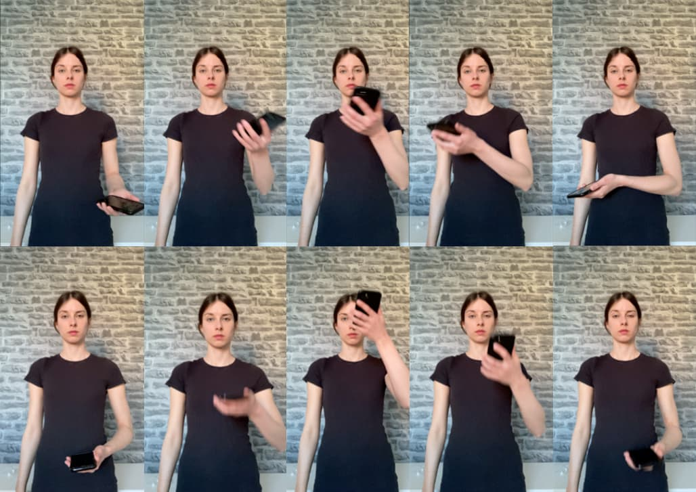

This thesis explores how non-visual modalities, especially gestures, can be utilized to enhance User Experience, taking as a probe an existing multiscreen, cross-device system. 

In the first Chapters of the thesis a theory on cross-device systems is being reviewed for the existing design frameworks, principles and practices, and a case study to further investigation of challenges and issues occurring in a chosen cross-device system is conducted.

As a conclusion of both theoretical and empirical research, the pivotal change in the design approach is made. The design opportunity focuses on exploring non-visual modalities in the context of the above-mentioned cross-device system. As a result of design activities, especially the co-creation session, gesture taxonomy is proposed. Gestures are described and documented in order to contribute to the field of HCI and to become an inspiration for designers aiming to design for cross-device systems beyond the screens. 

<MauVideo id="0_61nbc0ai" />
