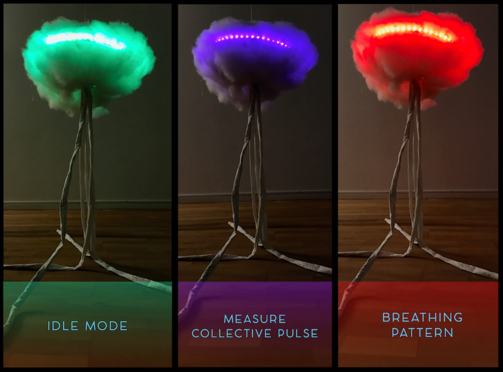

import MauVideo from "../../../components/MauVideo.astro"

The Meditation-Hub is designed to create collective bodily awareness in the context of group meditation. The work was inspired by notions of somaesthetics - our own perception and awareness of our body.

<MauVideo id="0_f7v59lzf" />

Meditation Hub reads the pulse of each participant, and this data collectively influence the behaviour of the light cloud.

