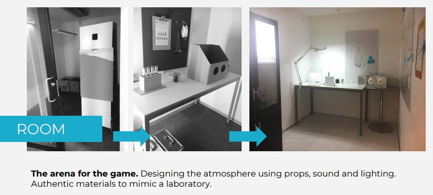
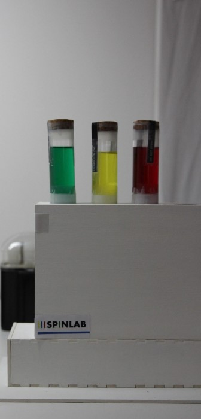

import MauVideo from "../../../components/MauVideo.astro"

“Welcome to the National Institute of Science. Before you get to work remember to put on your lab coats"

An escape room, set in a science laboratory, consisting of puzzles, hints and a background story. 

<MauVideo id="0_8xulo9m6" />

<figure class="imageSet">

</figure>
