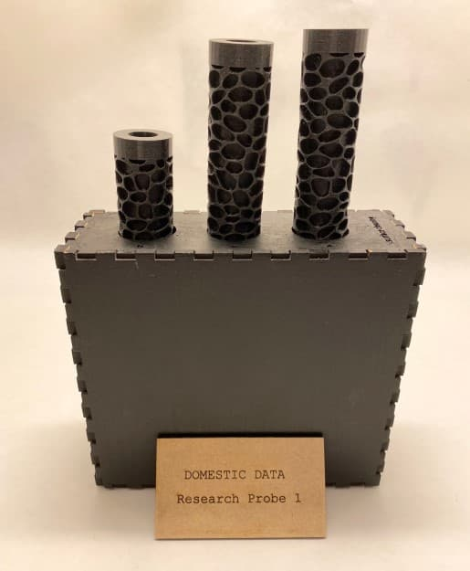
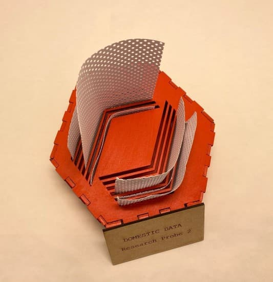
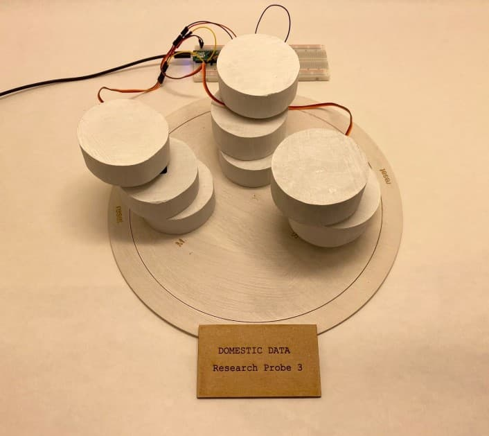

  
The division of domestic tasks in a household is an important aspect of social interactions. In this Research Through Design project we investigated how we can inform about the level of collaboration between household members and provoke social debates and discussions around the subject of domestic tasks divisions. We also wanted to research if collaboration can be improved by installing a data physicalization object in a household. To gain insights into what kind of conversation and actions might be facilitated by such a technology, we designed three prototypes of different shapes and conducted interviews around how people imagine these could impact their current division of household tasks. Based on the insights we got, we suggest that our work can be a starting point for further research into what self-monitoring collective technology probes reveal about the social routines in a home environment
  

The first prototype (above) emerged as an iteration of the first prototype built during the early stages of development. Representing a single household task group, surface cleaning,  it is distinguished by a porous surface pattern.

This second prototype (above) emerged as a more experimentational approach to the form of the object. A hexagon shaped wooden box present the support of wide shapes in perforated paper that display the visualization of six chores for two different members. This particular physicalization is meant to strengthen the desired aesthetical purpose of the object and at the same time to offer an overview of the object in a very active form

The third prototype (above) has cylindrical shapes that move directionally to physicalize data. The static part represents the base of the object that display the initials of the house members and information about the affordance of touch to reset the object to initial form. This prototype showcases a very dynamic approach and it is desired due to its ability to display more members in comparison to the previous ones. Furthermore, it is the only one where research about the collaborative reset effort will be undertaken.

We were able to confirm our initial assumption that Domestic Data physicalization would provoke a discussion and, to a certain degree, influence collaboration amongst household members. On the other hand, we admittedly didn't manage to obtain in-depth insights on the specifics of how these physicalizations would influence collaboration regarding domestic tasks.

Furthermore, our project has shown that, while an improvement of collaboration through physicalizing domestic activity data is possible, it is only one part of the probable outcomes. We have found out that the kind of conversation generated depends largely on the personal beliefs and social agreements already present around housekeeping. Nevertheless, the most noteworthy knowledge produced via this project is probably about the impact which a collective tracking device could possibly have on an otherwise often tacit interpersonal agreement.

In order to gain more knowledge on domestic activity collaboration, further research and testing would be required, especially long term. The logical next step of the research, from our point of view, should be to focus more on behaviors evoked by our probe. To achieve that goal, different scenarios and use cases for interviewees to place themselves in could be created. Additionally, fully functioning prototypes that make use of very advanced technology (e.g. sensors to capture activity data) could be used and the objects could be highly customized to better fit the needs of each specific home setting. It could finally be valuable to explore how domestic activities collaboration changes over time after placing those prototypes in homes for at least a week and conducting a series of interviews, leading focus groups and, if the circumstances allow it, engaging in field observation.
