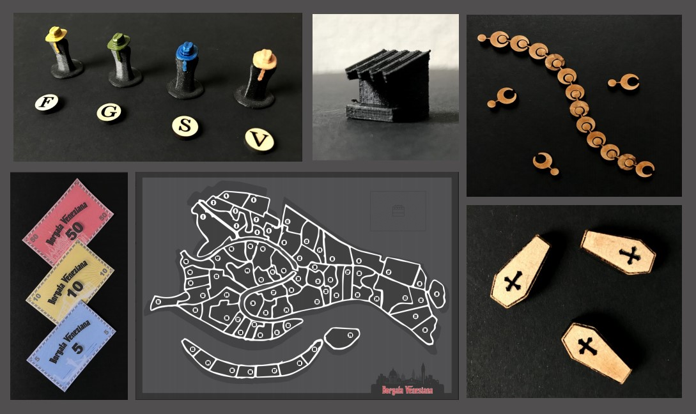
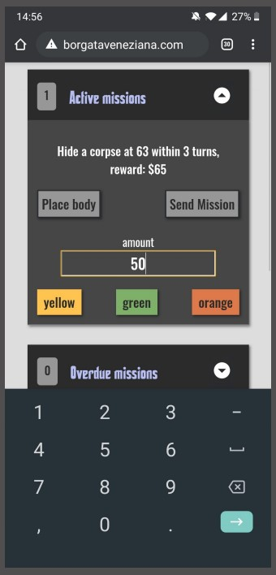

import MauVideo from "../../../components/MauVideo.astro"

_Borgata Veneziana_ is a game that combines Analog and digital components, using Their different capabilities to create a Holistic gaming experience

<MauVideo id="0_e0agdcpu" />

