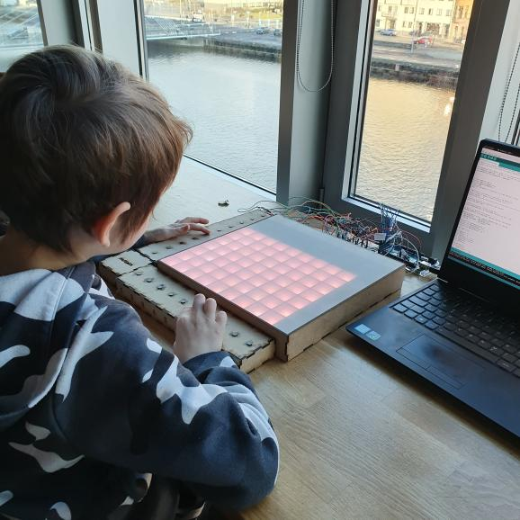

* Multiplix is a physical tool designed to help children with learning multiplication.
* This prototype was created to employ a more visual playful way to teach math to children.
* Three games are provided with Multiplix, an exploration mode, a problem-solving mode and a hint mode!

We are presenting a functional prototype created for those who want to learn multiplication in a playful and encouraging way. This physical tool can facilitate children’s learning thanks to its multiple engaging features. Our hopes with this prototype were to provide children with a mathematical tool that focuses less on symbols and equations and more on visualizing the numbers. For this we use colorful digital blocks displayed on a board. Current tangible tools to help learn multiplication seem to mostly encourage memorizing, not understanding, or are not able to let the child know if they are solving the numerical problems correctly. This prototype is not intended to replace the traditional methods of teaching multiplication, but rather complement it. We are hoping that Multiplix can be a great addition to the already existing multiplication tools that children are provided with. Multiplix uncovers that multiplication can be creative and full of discoveries. It also subtly introduces its sibling – division.

Multiplication and division are mathematical concepts that are not always easy to grasp. When multiplication is introduced to children, it often builds on addition, but over time and with bigger numbers, the focus is more on the pure memorization. Since multiplication and division go hand in hand, we wanted to seize this opportunity to create a tool that embraces this connection and lets children explore it. Through their own exploration and play they can gain a new kind of understanding of these operations and enjoy their learnings. Tangible buttons, visual feedback, lively colors and different modes are there to support them in doing so. Even one of our team members got a lasting impression from this prototype: "Now even I keep thinking about how 8x8=64, because of the sixty-four blue squares that lit up on the board!"

As of now, our mathematical prototype offers three different modes: an exploration mode, a problem-solving mode and a hint mode. The exploration mode allows the child to enter their own multiplication equations using the vertical and horizontal buttons. After the desired numbers were entered in by pressing the respective buttons, the tangible interface will activate, representing the answer with colored blocks. This way they can explore different numbers and their relations. Another mode this tool offers is a problem-solving mode, which is a game mode that provides the child with a multiplication answer on a separate screen and they are challenged to solve for it. They do so by pressing the correct numbers that need to be multiplied. The third mode is a hint mode, which is similar to the problem-solving mode, except for that it first displays a hint on the board. The hint is intended to encourage the learning by preventing the children from getting stuck and invite them to interact. Three different modes and that is just the beginning.
