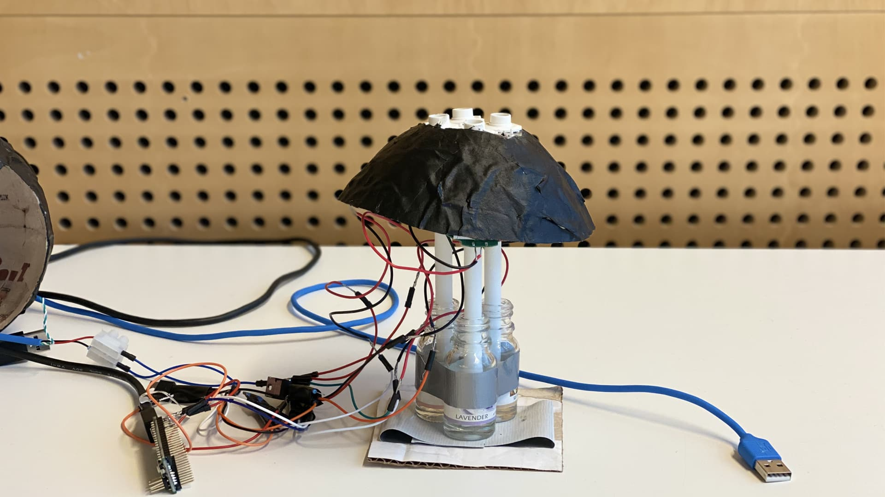

import MauVideo from "../../../components/MauVideo.astro"

Today’s video games constantly get better graphics and entire orchestras are used to record the soundtrack for games which is a pleasure for both our eyes and ears. But what if we could include one of our other senses into this experience? 

Nosy Nazo is a smell outputting stationary device that explores the potential of a smell-dimension as a guiding tool in a puzzle solving video game. The device is placed between the player and their keyboard. Depending on the position of the player and the scented objects in the game environment, the device will diffuse different scents at different strengths and in different blends. The scents are there to guide the player to make the right decisions to be able to solve the puzzle. 

<MauVideo id="0_lfn9kupg" />

In games, we usually depend on our sight and hearing but a sense that is constantly neglected is our sense of smell. We use our smell on a daily basis and shape our experience and knowledge by encountering it. Smell can for example help us to estimate outcome; will I like the food I am about to try? Has the food expired? Smell is also strongly connected to our memories, which means that we have the potential to recognize places and objects because we unconsciously connect them to their scent. 

The device itself consists of four modified humidifiers which we have connected to an Arduino Micro which is responsible for communicating between the virtual environment and the output device. For producing the needed smells we are using a mixture of essential oils and water based smell material that are homemade and placed inside the device and then outputted by the humidifiers. When closing in on the objects that smell in the game, the humidifiers start to emit the smell specific for the object. The smell strength is based on proximity, meaning that the closer you get to the object the stronger the smell will become. 

In order to evaluate our device we created a small demo of a video game that focuses on solving puzzles based on the scents. The structure and the purpose of the game is inspired by known puzzle solving video games like Portal or Superliminal. The two levels present the player with an escape room-like experience in which they have to find a way out of the room through solving a puzzle for they have to use their sense of smells to succeed. The context of the room and the objects in it will give the player a hint of what kind of scents that the room will emit. By using smell as interaction in games can not only contribute to a more immersive experience, but represent the more natural way of our behaviour. 
