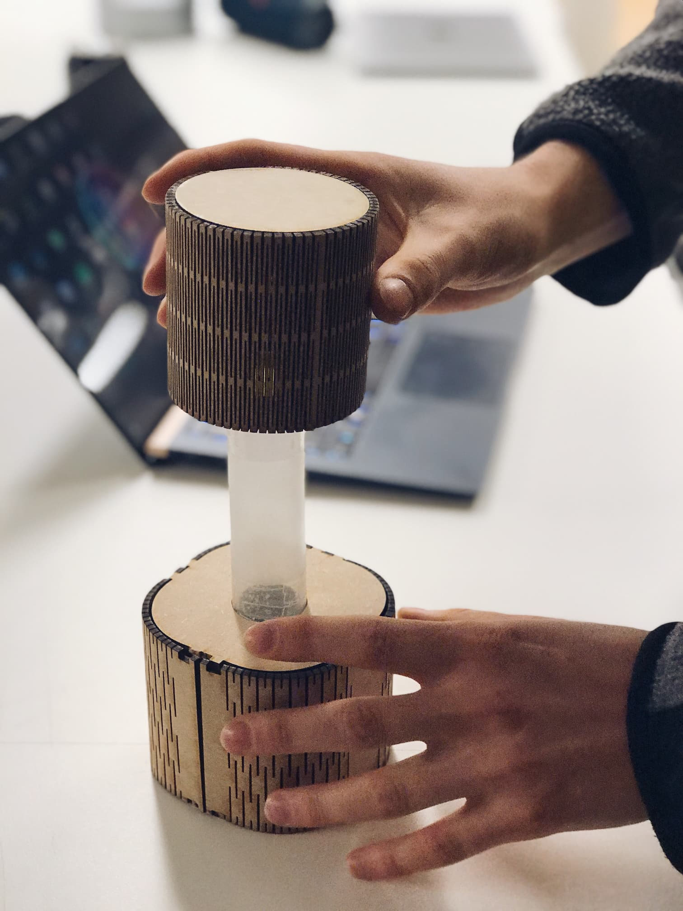

import MauVideo from "../../../components/MauVideo.astro"

<MauVideo id="0_8zd6wms6" />

Study Buddy introduces a new way of managing studies. 2019 has been a year with a drastic increase in studies from distance. We have identified problems in managing studies from home such as lack of motivation and focus on the study task, but also time management and responsibility seemed to be culprits that can be in the way of managing studies.

Study Buddy is a study companion for your desk introducing a new way of tackling those problems and boosting productivity. By using artificial intelligence, the study buddy provides an effective way of dealing with and overcoming the lack of motivation for university students. 

It works by simply activating the device and the AI persona will initiate a conversation with the user. The conversational agent is made possible by a development kit from Furhat Robotics which offers industry-leading social and conversational abilities. At first start up the AI will ask a series of questions to get to know the user and after that, it has enough data and is ready to work together with the student. 

Study Buddy grows over time as your companion. The more Study Buddy is used, the more it will grow and learn together with the student by learning the user’s study pattern and optimal study time. The buddy will provide value in guiding the student to have a higher level of motivation and take efficient breaks.

The device is designed on the mixed-initiation principle, meaning the user and the AI both equally collaborate to engage in reaching the goal of the assignment. The function of the form can be controlled physically by both the user and the AI creating conversational discussions upon physical interactions. Twisting, turning, and extending the device offers a quick way of handling different settings. 

One of its special features lies in its ability to initiate a reflective break which introduces a way for the user to strengthen their work and keep the focus on the right path. By conversing with Study Buddy in a meaningful way the user can be reminded through the conversation what was learned, what can be done better, and what to keep in mind. 

This project is created in the course Tangible and Embodied interaction by students in Malmö University, Interaction Design program:
* Samuel: concept development and TEI enthusiast
* Miroslav: Prototype and research enthusiast
* Karmen: passionate in creating embodied interactions using AI and ML    
* Vera: shaping conversation with AI & giving form to tangible interactive objects

