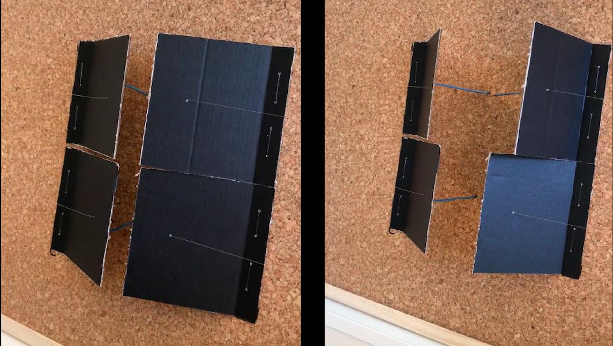
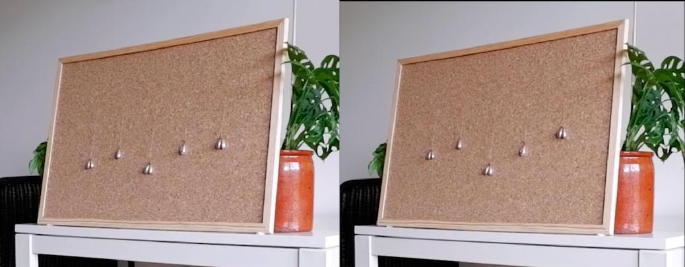
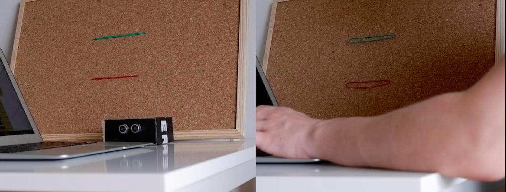
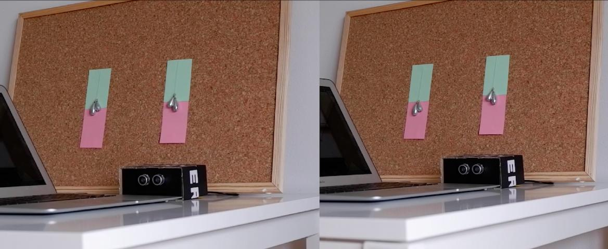

import MauVideo from "../../../components/MauVideo.astro"

During the Covid-19 pandemic, students have had to spend more time studying alone at home, in some cases leading to increased stress and anxiety.

This thesis explores qualities of _slow_, _calm_ and _persuasive_ technology with an aim for supporting self-reflection on time spent studying. 

The process in this thesis is explorative, moving from ideation, to digital and physical prototypes, with the author's reflections and experiences driving the process, while experience sessions with participants were used to ground findings in their reflections and  perspectives. 

Through this work, four interactivity qualities are suggested for supporting self-reflection of studying time: _flow_, _tension_, _unfolding_ and _balance_.

<figure class="imageSet">

</figure>

<MauVideo id="0_d42issg5" />
