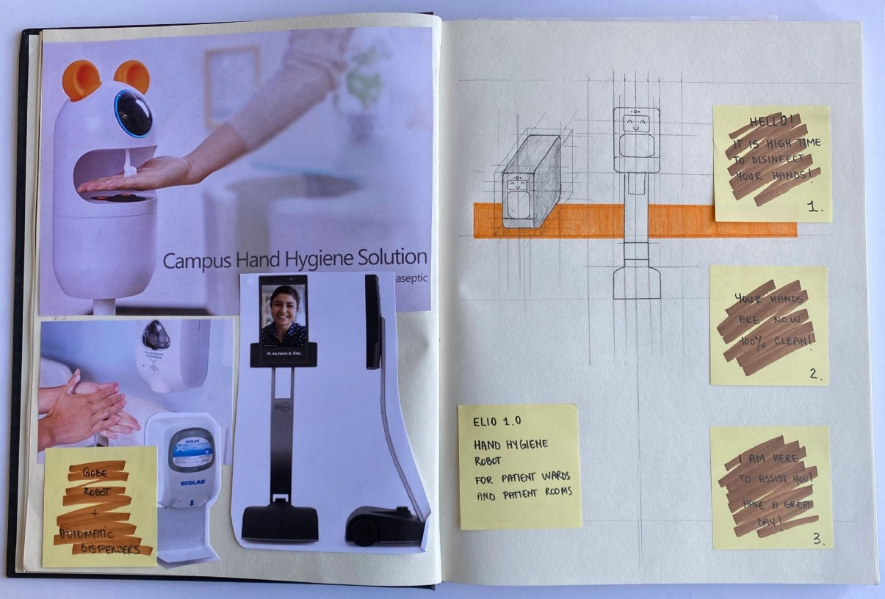
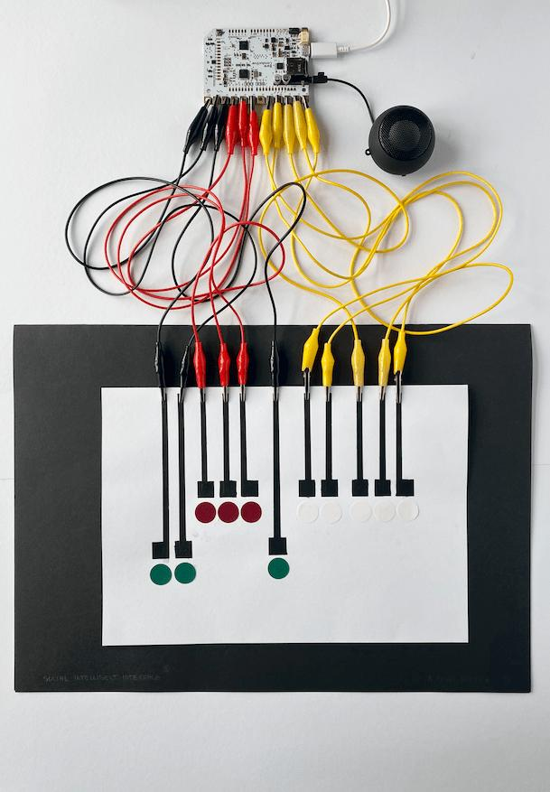
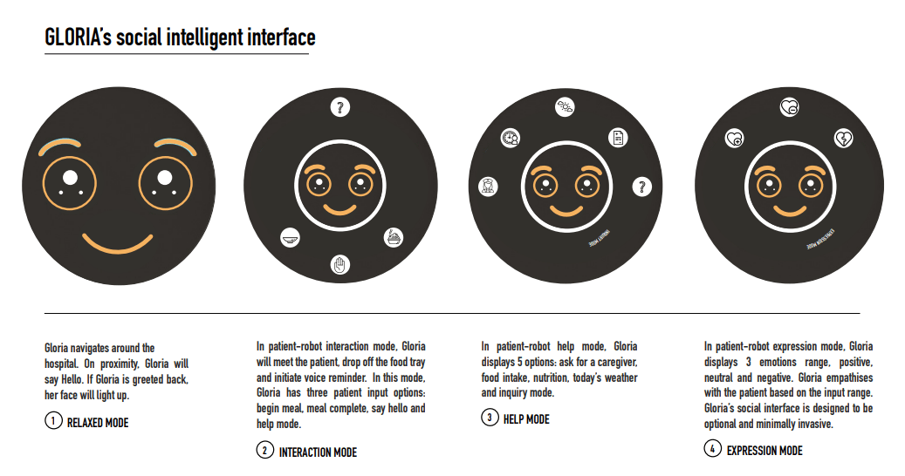
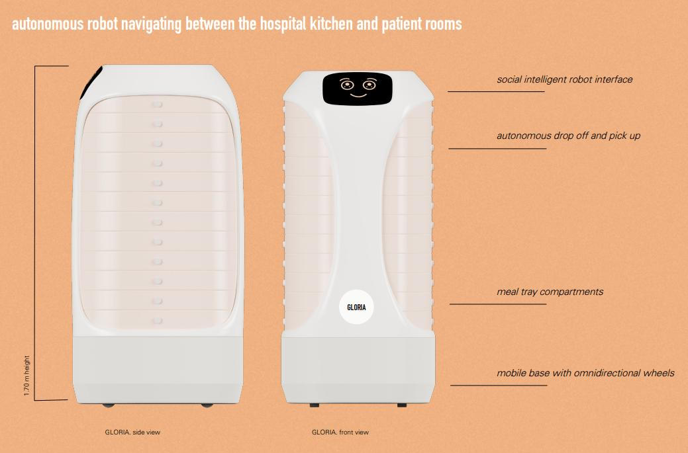

import MauVideo from "../../../components/MauVideo.astro"

A research-through-design inquiry into how socialites of a hospital environment are disrupted or improved by service robots. 

These kind of robots help with basic caregiver tasks, representing a new intermediary between patient and caregiver. Apart from other ethical and inclusive considerations given to this dialogue, of equal importance are the social values hidden in traditional workflows. This thesis generates constructive design research about emergent social norms and social dynamics caused by service robots’ implementation. 

## Sketching robot forms

The lessons learned are presented in a final research discussion. This social knowledge was further applied to a rehabilitation robot developed by the Copenhagen-based Blue Ocean Robotics company.

Three different robot concepts were developed, _Gloria_ for food delivery, _Elio_ for hand-hygiene and _Medi_ for medicine supply.

<MauVideo id="0_574ro86b" />

## A deconstructed social intelligent interface (low fidelity prototype)

## _Gloria_, the food delivery robot

<figure class="imageSet">

</figure>