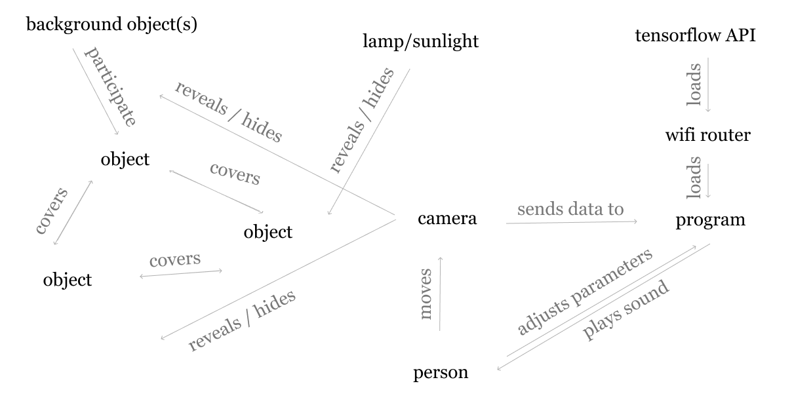
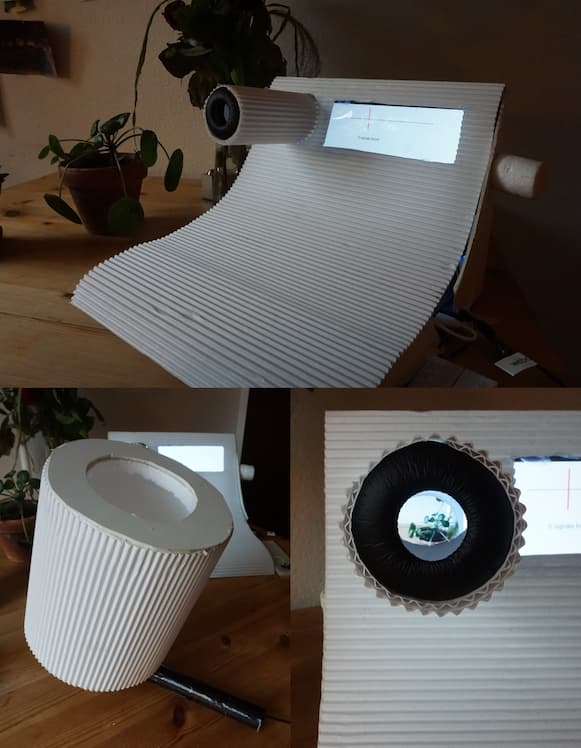

import MauVideo from "../../../components/MauVideo.astro"

<MauVideo id="0_267ppcjz" />

The ubiquitous yet opaque logic of machine learning complicates both the design process and end-use. Because of this, much of Interaction Design and HCI now focus on making this logic transparent through human-like explanations and tight control while disregarding other, non-normative human-AI interactions as technical failures. In this thesis I re-frame such interactions as generative for both material exploration and user experience in non-purpose-driven applications.

By expanding on the notion of machine learning uncertainty with play, queering, and more-than human design, I try to understand them in a designerly way. This re-framing is followed by a material-centred Research through Design process that concludes with _Object Detection Radio:_ a ludic device that sonifies object detection prediction probabilities. The design process suggests ways of making machine learning uncertainty explicit in human-AI interaction. In addition, I propose play as an alternative way of relating to and understanding the agency of machine learning technology.

# Early prototypes

The following video is an early prototype. Sliders are used to set the probabilistic threshold for each kind of object that is recognised. Lowering the threshold means that fuzzier (less likely) matches trigger the sound assigned to the object. Manipulating the scene by introducing objects, moving them or the camera influence how probable different objects are.

<MauVideo id="0_kt76s5bj" />

## Conceptualising relations between things

## Second prototype iteration

