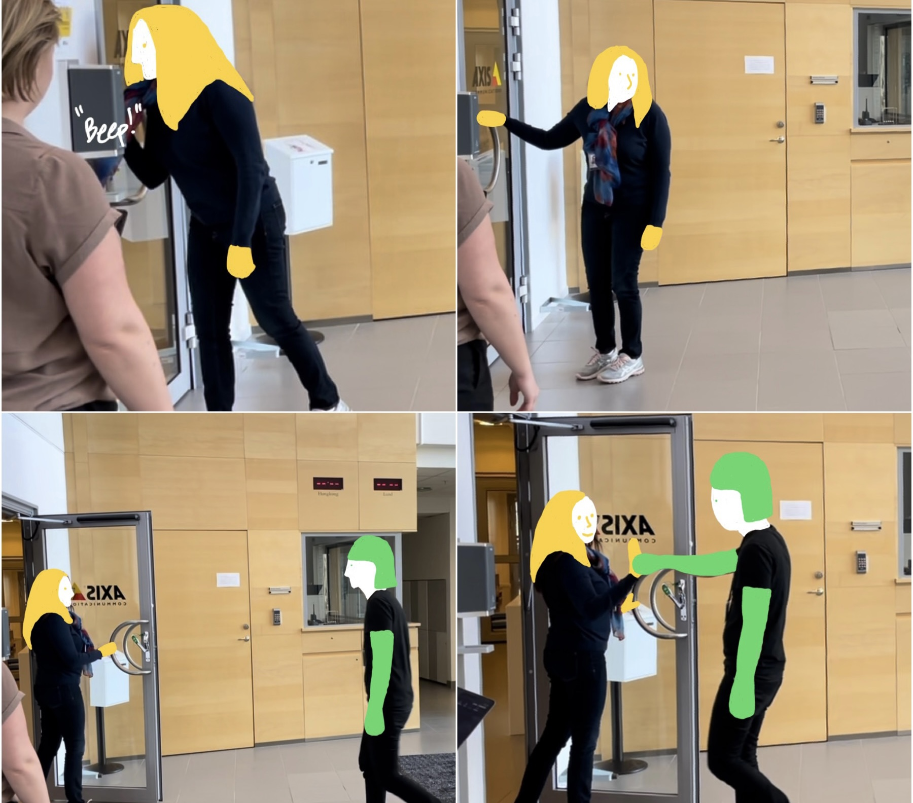

Access control is about letting authorised users in and keeping unauthorised people out. 

This project was done in collaboration with Axis, a provider of security-related systems. Their access control solution is a reader that takes in credentials and sends this information to the access controller. The access controller then matches the information with the system database. If the information is matched, the controller will unlock the door. 

While there is important work to be done about the optimisation and security of this system, the research question I developed is:

<blockquote>
  "How do the social and emotional aspects of humans affect access control security interactions?"
</blockquote>

Following Akrich, technology is affected by the social and the social is affected by technology. I did ethnomethodological fieldwork around these systems.

An interesting and common case is what happens when person has unlocked the door with their card, but along comes another person. The unlocker becomes the defacto enforcer of security and must choose to let the other person in on trust, or to cause social tension by inspecting the other person's card or forcefully re-engaging the system by closing the door immediately behind them.

From this basis, I prototyped a series of alternate interactions, trying to explore and understand how this shifted the social and emotional character of this scenario.

