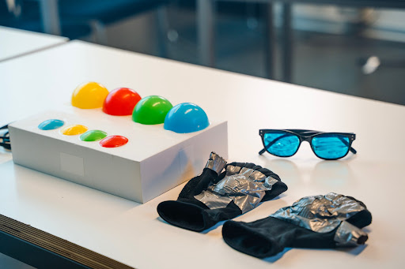
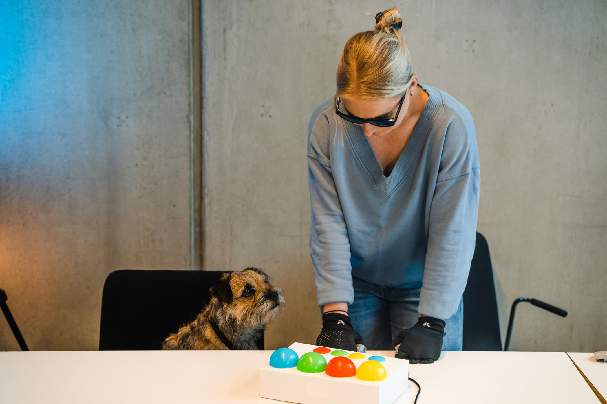

import MauVideo from "../../../components/MauVideo.astro"

This project proposes a complimentary method for participatory design practises used when the target users are dogs. The lack of common language and anthropocentric dynamic between humans and dogs highlight the need for finding means in which the design field can follow up Animal-Computer Interaction field principles. 

By creating simple prototypes that can improve the designers' understanding of dogs' experiences, the aim is to have a more efficient understanding of dogs' communication.

Four experience prototypes were tested and discussed with a group of designers to test the method in practice. 

One example experience prototype concerned how dogs visually perceive the world. The glasses block wavelengths of light to give the wearer a rough approximation of dog vision.

A colour coordination game was a part of the session to explore how the simulations affect usability from a dog's perspective. The game was based on coloured LED light signals and press buttons.

Other experience prototypes worked with dexterity and hearing.

<MauVideo id="0_oc9kc2z1" />

_Photos by Alexandra Raducanu_
