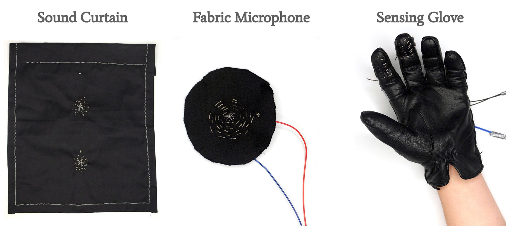

import MauVideo from "../../../components/MauVideo.astro"

Three forms were tried:

<figure>

<figcaption>1. Sound Curtain, 2. Fabric Microphone & 3. Sensing Glove</figcaption>
</figure>

# As a speaker

Insights
* Can produce audio, although at low volume
* Sound quality acceptable
* Flexible and soft

<MauVideo id="0_3vn439du" />
<figcaption>Producing sound</figcaption>

# As a microphone

Insights
* Very noisy, low gain
* Voices can be discerned
* Works well to detect impact

<MauVideo id="0_88dfro3q" />
<figcaption>Detecting impacts</figcaption>

# As a sensing glove

Insights
* Capacitive touch sensing yields direct touch, presence, in principle pressure
* Resistive sensing yields twisting, bending, stretching, in principle a sliding potentiometer

<MauVideo id="0_1c9kujy2" />
<figcaption>Resistance sensing</figcaption>

# Future work

* Affordances & aesthetic qualities of each form have not been fully explored
* Situating forms (and insights) in concrete use cases
