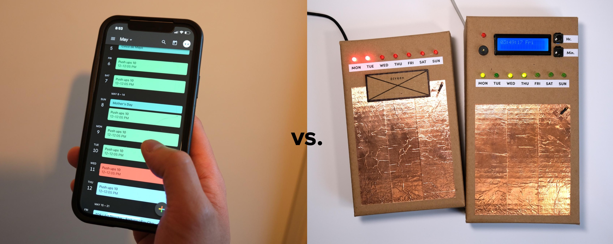
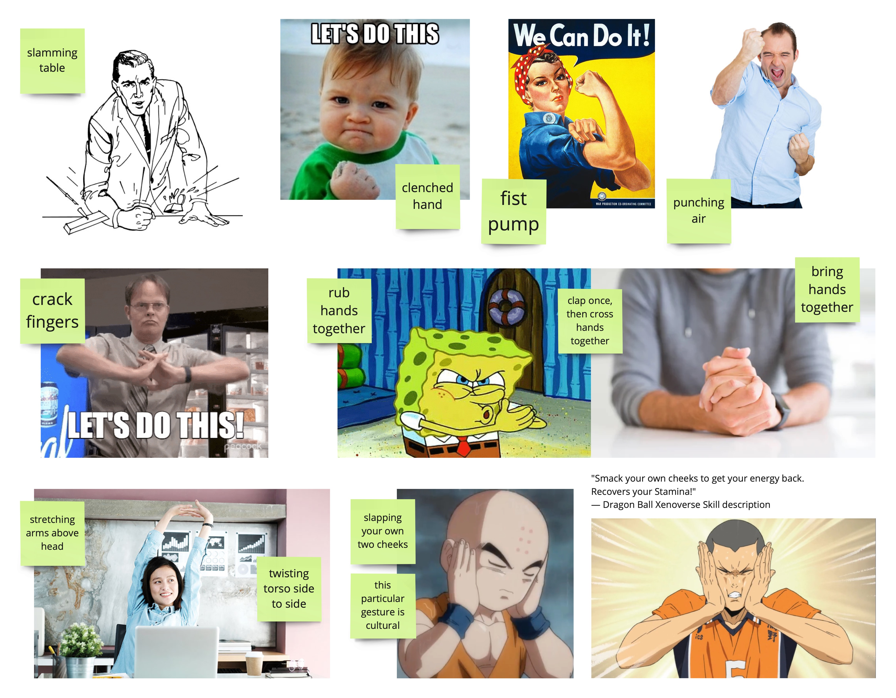

import MauVideo from "../../../components/MauVideo.astro"
  
n comparison to graphic user interfaces (GUI), how might tangible user interfaces (TUI) help strengthen a sense of commitment and improve user engagement to carry out a plan?

Some studies argue that the advantage of TUI over traditional GUI is still unclear, while others state that physicality of the TUI increases enjoyment and has a stronger potential for engagement.

This project attempts to compare these two arguments.

# Comparison case

<MauVideo id="0_nbn946dv" />

## TUI

1. The purpose of this prototype is to help people to build a new daily routine.
2. First, decide on the task and set a time.
3. The task must be easy and digestible.
4. When the alarm turns on, turn it off with a decisive gesture.
5. This means a start of the task.
6. When finished, use the same gesture to log complete for the day.
7. It tracks 7 days of progress.

What could be a 'decisive gesture' for completing a goal, how can this moment be made physical?

# Findings

* TUI is not exactly better than GUI
* Unstable environment has been more critical to the plan
* TUI-based notifications are not as effective as GUI because users cannot carry the TUI device at all times

Strengths of the TUI
* Stronger emotions
* Greater attachment
* Feels conclusive & satisfying
* Lasting impression
* Promise of better sustained results
* The smartphones are superior as a notification tool, but they lack something tangible to ground the following action.

# Conclusions

There is potential benefit to blending GUI for notification, and TUI for input. Having a tangible device in front of you is harder to ignore compared to simply closing an app.

