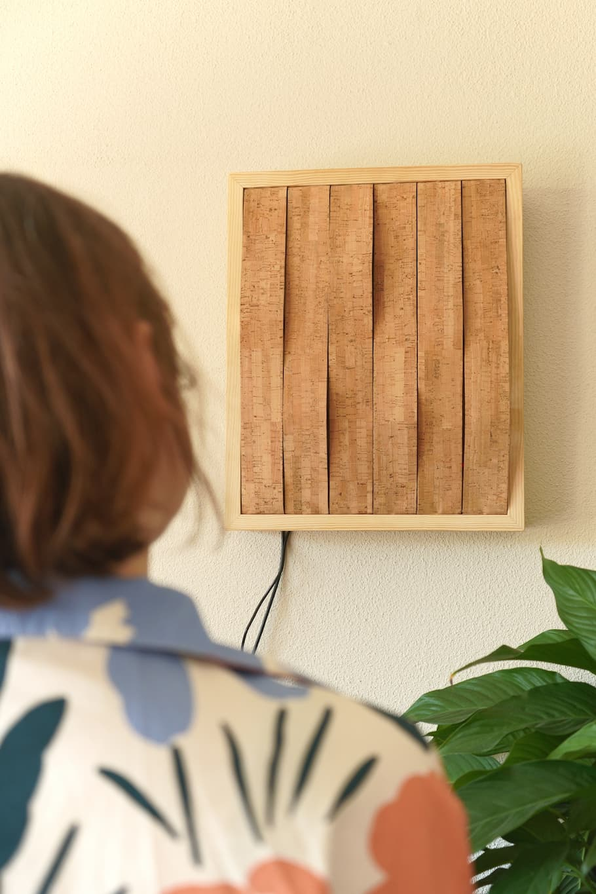
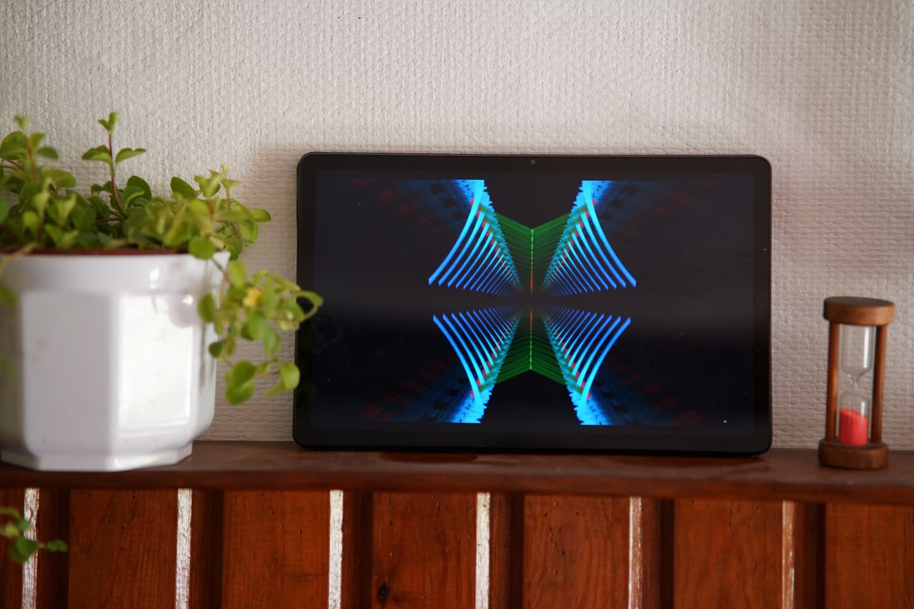
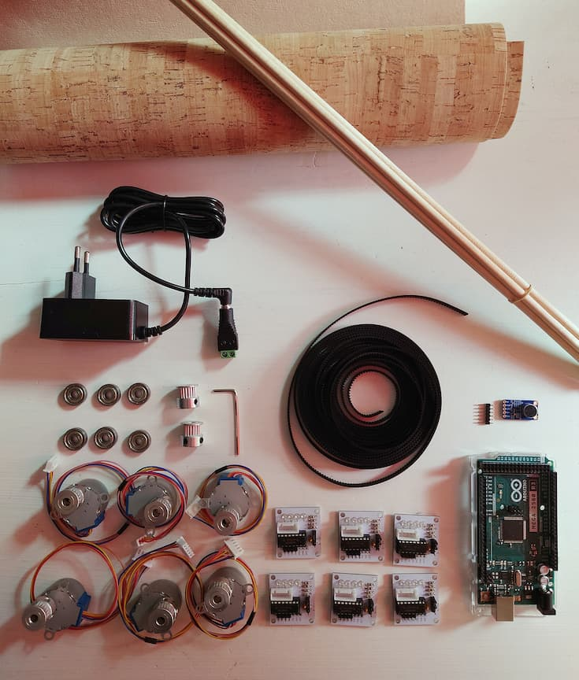
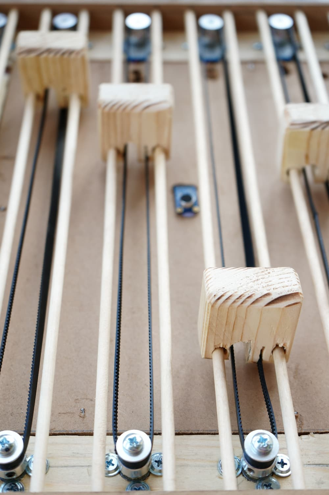

import MauVideo from "../../../components/MauVideo.astro"

The project aimed to increase awareness of the domestic soundscape in the living room by investigating current indoor activity patterns and design gaps in domestic soundscape and interaction design via implicit interactions.

<MauVideo id="0_2ao4aqov" />

# Experimentation

Experiments were conducted to investigate the visual aspects of sound. Each experiment provided unique experiences and an understanding of the complexities entailing sound representation
to increase awareness.

# Production

A design was created with the primary goal of balancing aesthetics and user experience. Resulting in the Resonant Frame, a device that uses Arduino and actuators to dynamically visualise sound frequencies in a living room.

# How it works

It has six outputs powered by six motors. Each output measures a frequency through a microphone at a specific interval and moves to either a low, medium, or high positions based on the intensity and occurrence of the frequency measured.