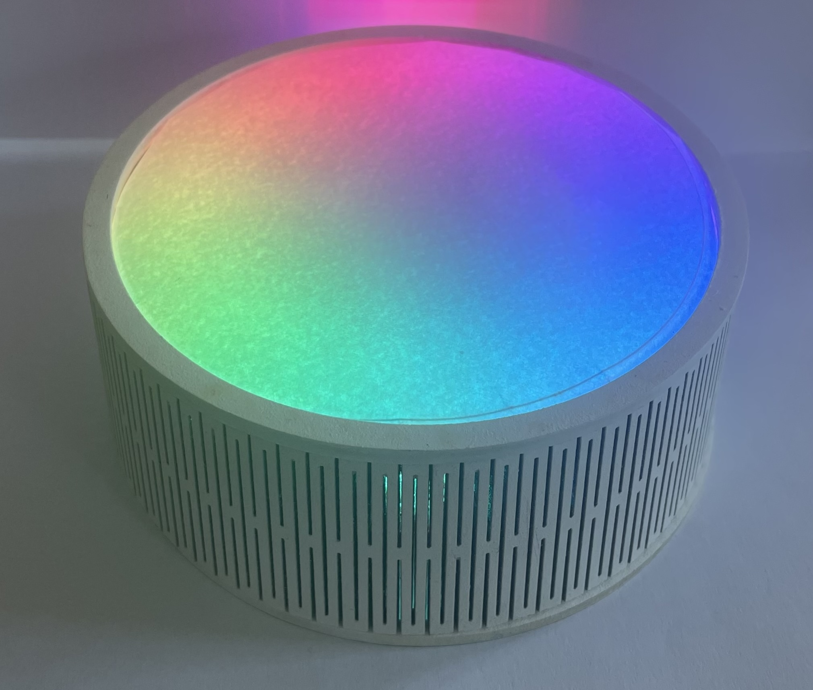
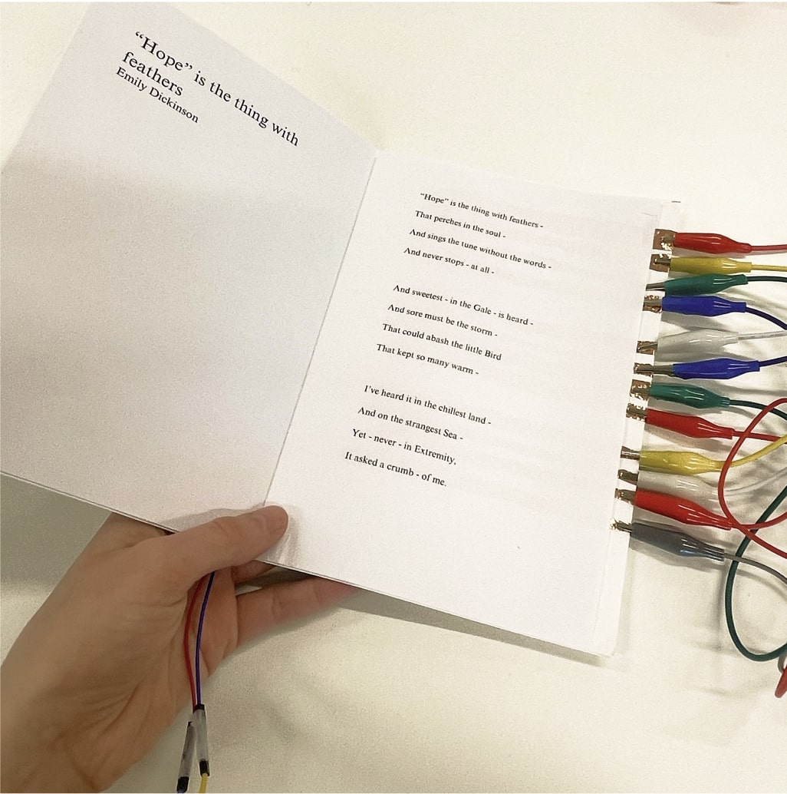
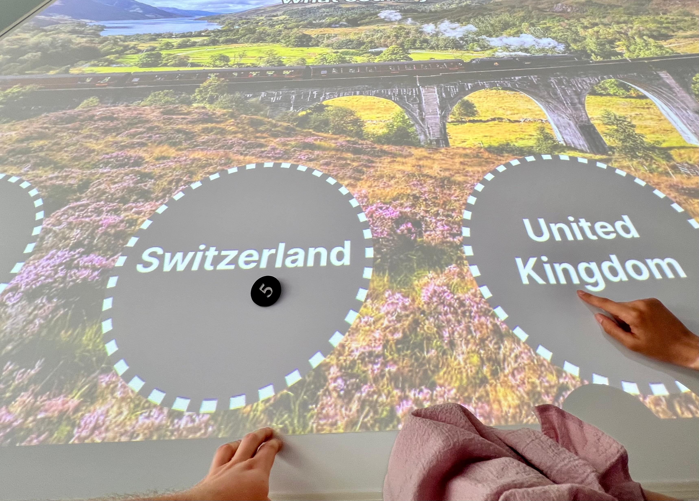
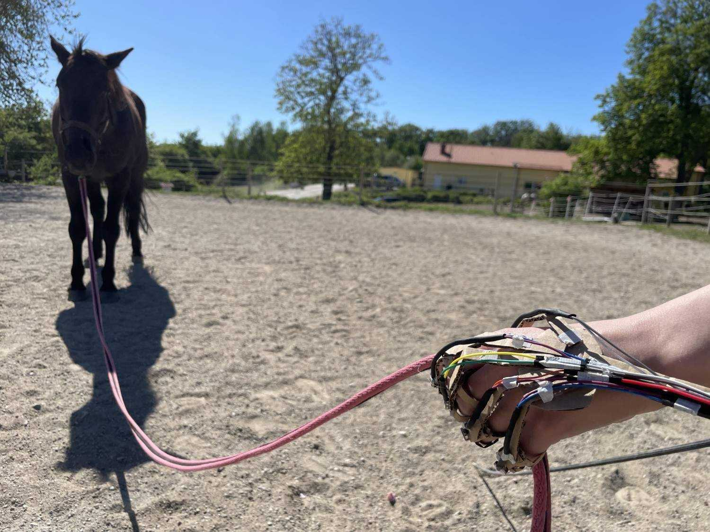

import MauVideo from "../../../components/MauVideo.astro"

# StatuSphere - an ambient lamp for conveying availability
## Merjem Cengic

Interruptions in the office can cause negative feelings if they happen at inconvenient times. Current strategies for assessing someone’s availability involve relying on visual cues, which can be misinterpreted or lead to false assumptions about a colleague's availability. 

To help office workers make informed decisions before interrupting, an ambient lamp will convey a colleague’s availability through text and light. The lamp activates itself only through implicit interaction, such as when someone looks over a colleague's desk or approaches the lamp.

# Touch the Poetry
## Roza Zoltowska

Poetry's abstract nature often makes it challenging to connect with emotionally, limiting its accessibility. To address this, I propose a device that integrates touch sensors into a poetry book. As readers trace verses with their fingers, these sensors create vibrations reflecting the poem's emotions and rhythm. This multi-sensory experience aims to make the complexities of poetry more accessible, allowing readers to not only see and hear but also feel its emotional nuances. By enhancing engagement and understanding, this project seeks to revitalize poetry's relevance and emotional resonance.

# Playful Connections
## Alex Erixon

Museums are often visited in groups, but exhibits are not always designed to accommodate this. How can interactive technology be implemented to support and encourage social engagement? 

The project explored interaction through physical objects that could be passed around and placed. Using a large table to gather around, encouraging movement and cooperation, intentionally spreading out information and interaction zones.

A shared experience is one motivator for group visitors to museums. The concept seeks to provide that directly through play, but also linking to the overall museum visit. Topics specific to the group’s background was tested, contrasting with generic ones, as well as collaborative play contrasting competitive game setups.

# Horse lungeing with AR and Haptics
## Etel Narest

When horse lungeing, handlers face challenges that hinder desirable training outcomes. A key contributing factor to this is the overlooking of scientific theories, which has shown that the placement of the handler’s hands, and the environment affecting the horse psychologically, play major roles in training outcomes. 

During prior research, it was investigated if AR with the help of artificial intelligence could help handlers overcome these mistakes. This was done by providing real-time feedback based on equine theory and analyzing the handlers and the horse's body movement. It was concluded that AR applications are feasible for addressing these issues, however, it was also highlighted that the limiting factors of AR need to be carefully considered.

Following feedback from stakeholders, two prototypes were pursued. The first is an AR headset, and the second uses a camera paired with headphones and haptics. The outcomes of this project show that the second vibration-controlled haptics prototype worked better for test users, providing them with interactive and intuitive feedback.

In contrast, the AR-headset prototype did not yield positive feedback, making users feel insecure about their surroundings due to AR’s limited field of view. 

